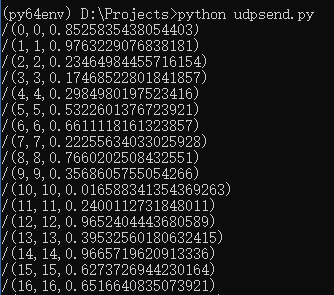
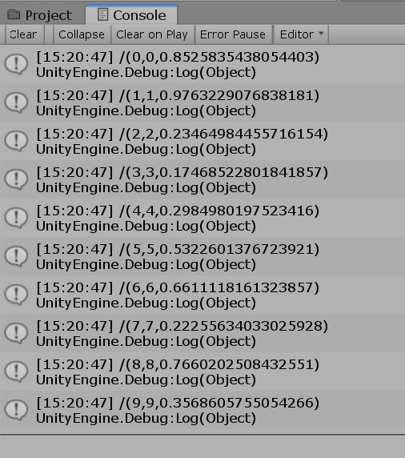

# udp_unity_hearratemonitor
A udp client in unity to receive and display heart rate data

# Update on 1/16/2020

The "./UDP" folder includes two files:

1. UDPSend.py
The script includes function of sending data through UDP using python-osc package. 

1) setup: python(3.5+), using command: pip install python-osc

For more information: [click](https://github.com/attwad/python-osc).

2) initial parameters:
ip: 127.0.0.1

port: 5005

message format: /(integer,integer,float)

loop: 100

message time: 0.1s (can be set using function sleep(time per frame))

2. ECGOSCMessageReceiver.cs
The script should be attached to any object in the scene. If there is an error message related to "transporttype missing", change the unity project setting/player/scripting runtime version into ".NET 3.5 Equivalent". 

1) setup: unity(c#)

2) initial parameters:
port: 5005

3) Received data location in code: 
line 121: ((OscMessage)packet).Address in function private void ShowMessage(OscPacket packet)

Enjoy:)
