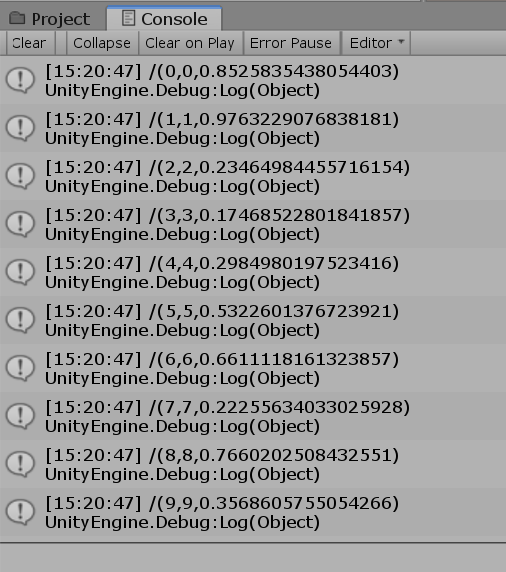

# UDP Python sender and C# receiver
UDP client and server using osc lib.

## Update on 1/16/2020
In command line (run python)


In unity (in console logging)



## This folder includes two parts:

### 1. UDPSend.py
The script includes function of sending data through UDP using python-osc package. 
* setup: python(3.5+), using command: pip install python-osc .
For more information: [click](https://github.com/attwad/python-osc).
* initial parameters:
```
ip: 127.0.0.1
port: 5005
message format: /(integer,integer,float)
loop: 100
message time: 0.1s (can be set using function sleep(time per frame))
```
### 2. ECGOSCMessageReceiver.cs (included in the package) and UDP_UNITY_RECEIVER.unitypackage
The script should be reattached to any object in the target scene. If there is an error message related to "transporttype missing", change the unity project setting/player/scripting runtime version into ".NET 3.5 Equivalent". 
* setup: import UDP_UNITY_RECEIVER.unitypackage into scenes in unity(c#)
* attach the ECGOSCMessageReceiver.cs to an object in the target scene
* initial parameters: port: 5005
* Receiving code location: 
```
line 121: ((OscMessage)packet).Address 
//in function private void ShowMessage(OscPacket packet)
```

Enjoy:)
